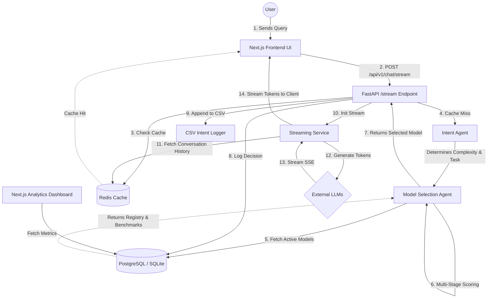

# Adaptive Chat AI

Adaptive Chat AI is a multi-model router and chat interface. It detects user intent, estimates token budgets, and selects the most suitable model from an active registry based on quality, latency, and cost.

---

## Key Features

- **Intent Detection Agent**: Analyzes prompts using a hybrid architecture (Laya System 1 fast classifier with ChromaDB semantic anchor fallback) to determine task type and complexity.
- **Cost Optimization Agent**: Uses local tokenization (`tiktoken`) to calculate budgets and prevent oversized models from handling simple requests.
- **Model Selection Agent**: Scores and selects models dynamically based on quality, latency, cost, and availability.
- **Live Analytics Dashboard**: Visualizations for token usage over time, cache hit rates, and estimated cost distribution grouped by AI provider.
- **Real-Time Intent Logging**: Logs user queries and detected intent tasks directly to a CSV file (`chat_intents.csv`) for offline dataset generation and evaluation.
- **Exact-Match Redis Caching**: Intercepts repeated queries before hitting provider APIs to return cached responses with low latency and zero API cost.
- **Prompt Optimization Agent**: Refines vague prompts for clearer model execution.
- **Tool Calling Framework**: Supports calculator, web search, and Python code execution tools.
- **RAG Pipeline**: FAISS integration for document search across PDFs, Word documents, and text files.
- **Fallback Router**: Retries with a secondary candidate if the primary model fails.

---

## Architecture Stack

- **Backend API**: FastAPI (Python 3.11/3.12), AsyncIO
- **Database**: PostgreSQL (SQLAlchemy ORM) with automatic SQLite fallback for local development
- **Short-Term Memory & Cache**: Redis
- **Embedding & Search**: ChromaDB, FAISS
- **Frontend**: Next.js, React, TypeScript, Tailwind CSS
- **Observability**: Prometheus, Loguru

---

## System Workflow



---

## Quickstart (Docker)

The fastest way to run the full stack is using Docker Compose.

1. **Set your API Keys**
   Create a `.env` file in the root directory:
   ```env
   GOOGLE_API_KEY=your_gemini_api_key_here
   OPENROUTER_API_KEY=your_openrouter_api_key_here
   JWT_SECRET_KEY=generate_a_secure_random_string
   ```

2. **Start the containers**
   ```bash
   docker compose up -d --build
   ```

3. **Access the services**
   - Frontend UI: http://localhost:3000
   - Backend API Docs: http://localhost:8000/docs
   - Prometheus Metrics: http://localhost:8000/metrics

---

## Local Development (Without Docker)

### 1. Backend Setup
```bash
# Install dependencies using uv
uv sync

# Run the API
powershell scripts/run_backend.ps1
```

### 2. Frontend Setup
```bash
cd frontend
npm install
npm run dev
```

---

## API Reference

### Chat Streaming Endpoint
```bash
curl -X POST "http://localhost:8000/api/v1/chat/stream" \
     -H "Content-Type: application/json" \
     -d '{
           "query": "Write a python script to parse a CSV file.",
           "session_id": "user_session_123"
         }'
```

### Register a Model
```bash
curl -X POST "http://localhost:8000/api/v1/registry/" \
     -H "Content-Type: application/json" \
     -d '{
           "name": "google/gemini-2.5-flash",
           "provider": "google",
           "cost_per_1k_tokens": 0.00015,
           "supports_vision": true,
           "supports_tools": true
         }'
```

---

## License

MIT License
